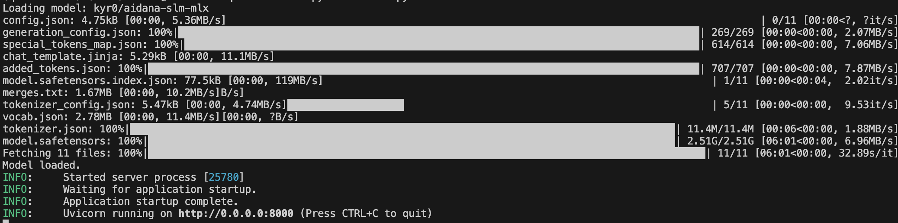
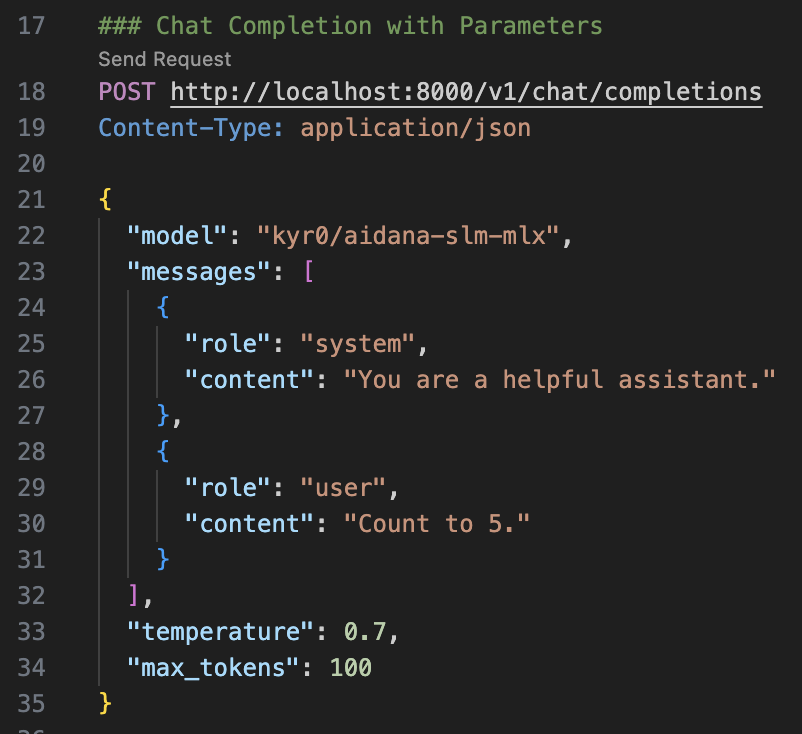
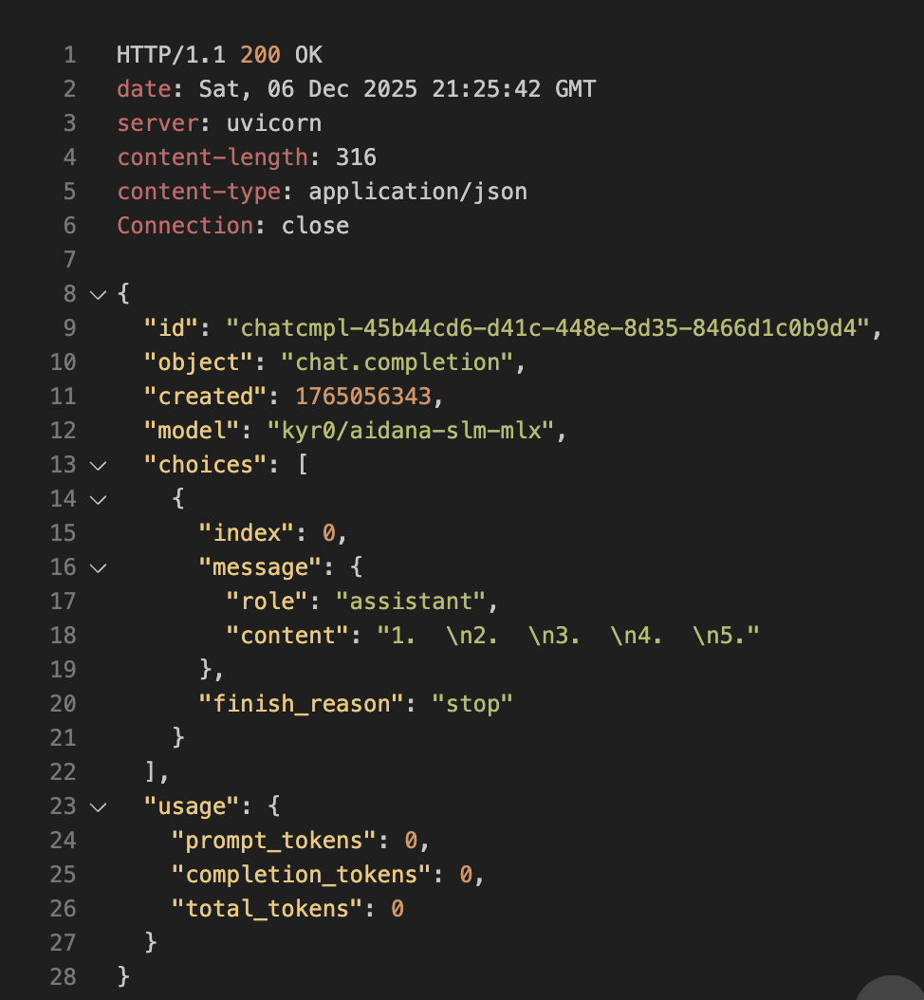
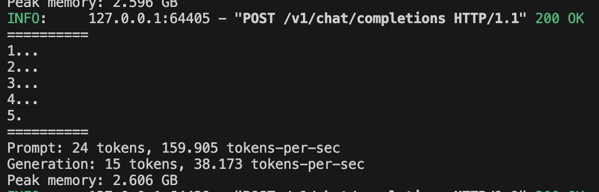
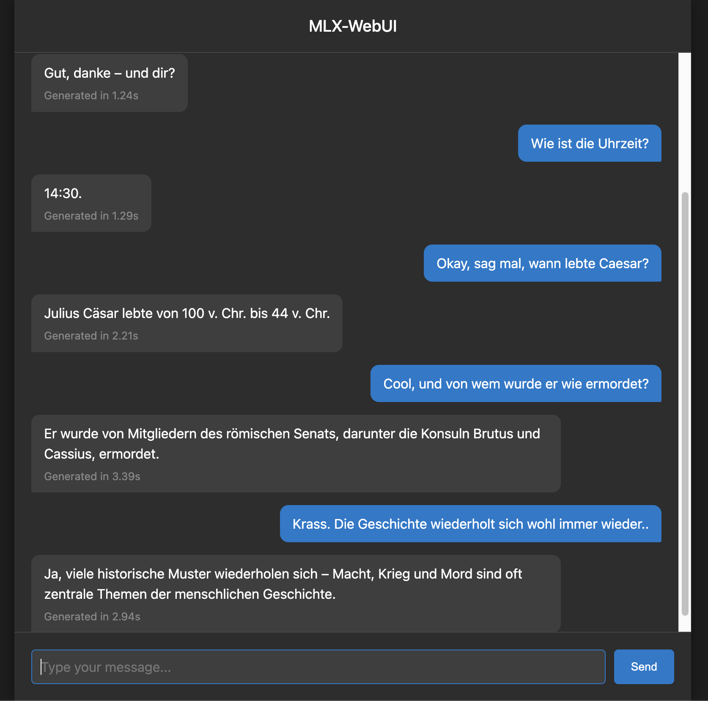

# MLX-WebUI

MLX-WebUI is a tiny inference server and WebUI for MLX-based models.

Default SLM: kyr0/aidana-slm-mlx _(2.5 GB, 4-bit quantized Qwen3-VL-4B with Deckard quantization architecture)_ - runs at 37-40 TPS generation on M4 (Macbook Air) - [HuggingFace](https://huggingface.co/kyr0/aidana-slm-mlx)

## Quick Start

1. **Install uv** (extremely fast Python package installer):

Prerequisites: 
- [Homebrew](https://brew.sh/) (MacOS) 

```bash
brew install uv
```

2. **Setup environment and install dependencies**:

```bash
uv venv && source .venv/bin/activate
uv pip install -r requirements.txt
```

3. **Run the server**:

```bash
python server.py
```

The server will start at `http://0.0.0.0:8000`. Visit it with a web browser to see the chat interface. You can test it using the `test_requests.http` file or standard OpenAI client libraries.

## Impressions

### Setup

Setup will take a while as it downloads the default SLM model (~2.5 GB).



### API

Calling the OpenAI-compatible API:



Response (non-streaming):



Console log:



### Using the WebUI

Visit [`http://0.0.0.0:8000`](http://0.0.0.0:8000) in your browser to see the WebUI.

